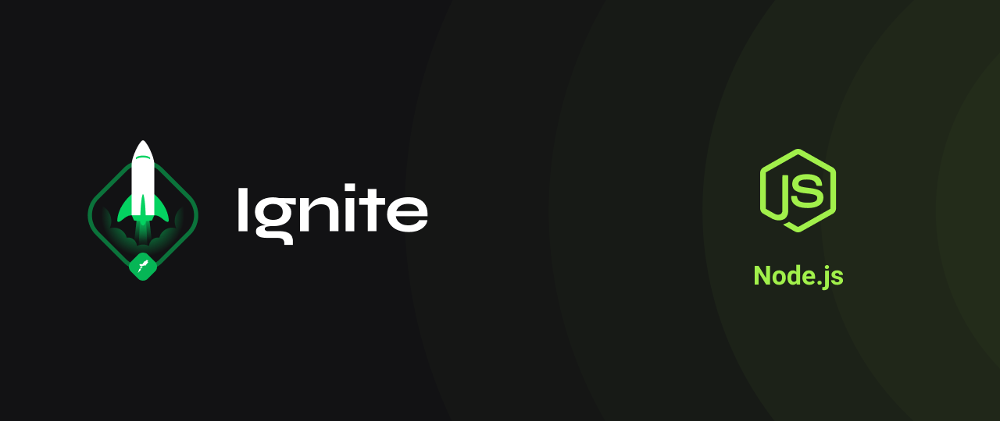

<div align="center" id="top"> 
  

&#xa0;

  <!-- <a href="https://ignitecorrigindoocodigo.netlify.com">Demo</a> -->
</div>

<h1 align="center">Ignite | Trilha NodeJS: Desafio 3 -  Corrigindo o Codigo</h1>

<p align="center">
  

  

  

  

  <!--  -->

  <!--  -->

  <!--  -->
</p>

<!-- Status -->

<!-- <h4 align="center">
	🚧  Ignite Corrigindo o Codigo 🚀 Em construção...  🚧
</h4>

<hr> -->

<p align="center">
  <a href="#computer-sobre-o-desafio">Sobre</a> &#xa0; |  &#xa0;
  <a href="#rocket-tecnologias">Tecnologias</a> &#xa0; | &#xa0;
  <a href="#white_check_mark-pré-requisitos">Pré requisitos</a> &#xa0; | &#xa0;
  <a href="#checkered_flag-começando">Começando</a> &#xa0; | &#xa0;
  <a href="#memo-licença">Licença</a> &#xa0; | &#xa0;
  <a href="https://github.com/thiilins" target="_blank">Autor</a>
</p>

<br>

## :computer: Sobre o desafio

Nesse desafio, temos uma aplicação Node.js que está em processo de desenvolvimento mas que já possui os testes necessários para fazer toda a validação dos requisitos (você não deve mexer nos testes).
Após algumas alterações no código da aplicação, parte dos testes deixaram de passar e agora só você pode resolver esse problema. Bora lá? 🚀

Essa aplicação realiza o CRUD (**C**reate, **R**ead, **U**pdate, **D**elete) de repositórios de projetos. Além disso, é possível dar likes em repositórios cadastrados, aumentando a quantidade de likes em 1 a cada vez que a rota é chamada.

A estrutura de um repositório ao ser criado é a seguinte:

```jsx
{
  id: uuid(),
  title,
  url,
  techs,
  likes: 0
}
```

Descrição de cada propriedade:

- **id** deve ser um uuid válido;
- **title** é o título do repositório (por exemplo "unform");
- **url** é a URL que aponta para o repositório (por exemplo "[https://github.com/unform/unform](https://github.com/unform/unform)");
- **techs** é um array onde cada elemento deve ser uma string com o nome de uma tecnologia relacionada ao repositório (por exemplo: ["react", "react-native", "form"]);
- **likes** é a quantidade de likes que o repositório recebeu (e que vai ser incrementada de 1 em 1 a cada chamada na rota de likes).

Note que a quantidade de likes deve sempre ser zero no momento de criação.

### GET `/repositories`

A rota deve retornar uma lista contendo todos os repositórios cadastrados.

### POST `/repositories`

A rota deve receber `title`, `url` e `techs` pelo corpo da requisição e retornar um objeto com as informações do repositório criado e um status `201`.

### PUT `/repositories/:id`

A rota deve receber `title`, `url` e `techs` pelo corpo da requisição e o `id` do repositório que deve ser atualizado pelo parâmetro da rota. Deve alterar apenas as informações recebidas pelo corpo da requisição e retornar esse repositório atualizado.

### DELETE `/repositories/:id`

A rota deve receber, pelo parâmetro da rota, o `id` do repositório que deve ser excluído e retornar um status `204` após a exclusão.

### POST `/repositories/:id/like`

A rota deve receber, pelo parâmetro da rota, o `id` do repositório que deve receber o like e retornar o repositório com a quantidade de likes atualizada.

&#xa0;

## :rocket: Tecnologias

As seguintes ferramentas foram usadas na construção do projeto:

- [Node.js](https://nodejs.org/en/)

## :white_check_mark: Pré requisitos

Antes de começar :checkered_flag:, você precisa ter o [Git](https://git-scm.com) e o [Node](https://nodejs.org/en/) instalados em sua maquina.

## :checkered_flag: Começando

```bash
# Clone este repositório
$ git clone https://github.com/thiilins/ignite-corrigindo-o-codigo

# Entre na pasta
$ cd ignite-corrigindo-o-codigo

# Instale as dependências
$ yarn

# Para iniciar o projeto
$ yarn dev

# O app vai inicializar em <http://localhost:3000>
```

## :memo: Licença

Este projeto está sob licença MIT. Veja o arquivo [LICENSE](LICENSE.md) para mais detalhes.

Feito com :heart: por <a href="https://github.com/thiilins" target="_blank">Thiago Lins</a>

&#xa0;

<p align="right">(<a href="#top">Voltar para o topo</a>)</p>
